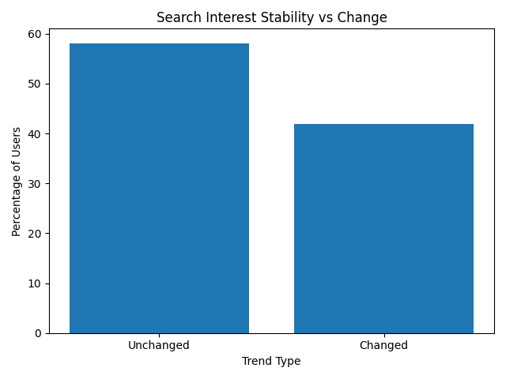
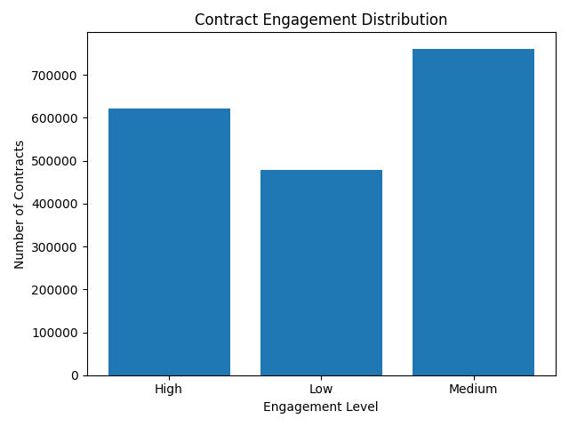

# Analytics Output Report

## Customer Behavior Analytics Pipeline

This document summarizes the final outputs of the analytics pipeline.
All results are derived from SQL analytics marts in DuckDB and visualized as static charts.

### Overview of Outputs

The pipeline produces three main categories of output:

Analytics marts (SQL views) – authoritative, reusable results

Static visualizations (PNG) – documented summaries

Interactive dashboard (Streamlit) – exploratory analysis

This file focuses on (1) and (2).
The Streamlit dashboard is a complementary, interactive consumer of the same data.

### Search Stability vs Change

**Visualization**



**Source: `mart_interest_change_summary`**

**Query used**

```
SELECT
    category_june || ' → ' || category_july AS transition,
    users
FROM mart_interest_change_summary
WHERE trending_type = 'Changed'
ORDER BY users DESC
LIMIT 10;
```

**Description**

This output measures how stable user search interests are between two periods (June → July).

Each user is classified as:

- Unchanged – dominant search category stayed the same

- Changed – dominant category changed

The chart visualizes the percentage of users in each group.

**Interpretation**:

- A larger Unchanged share indicates stable, predictable interests

- A meaningful Changed share suggests evolving or event-driven demand

### Interest Transition Patterns

**Visualization**


**Source `mart_interest_change_summary`**

**Query used**

```
SELECT
    category_june || ' → ' || category_july AS transition,
    users
FROM mart_interest_change_summary
WHERE trending_type = 'Changed'
ORDER BY users DESC
LIMIT 10;
```

**Description**

This output focuses only on users whose interests changed, highlighting the most common directional transitions between content categories.
Each bar represents:

- a transition from June category → July category
- the number of users who made that transition

**Interpretation**

- Interest changes are often between related genres
- Indicates cross-category discovery rather than random churn

### Contract Engagement Levels

**Visualization**



**Source `mart_contract_engagement`**

**Query used**

```
SELECT engagement_level, COUNT(*) AS contracts
FROM mart_contract_engagement
GROUP BY engagement_level;

```

**Description**
This output segments contracts into Low, Medium, and High engagement tiers based on actual activity.

Engagement is derived from ActiveDays, representing the number of distinct days with content interaction.

**Engagement definition**
| Level | Definition |
| ------ | ---------------------- |
| High | ≥ 60% of observed days |
| Medium | 30–59% |
| Low | < 30% |

Thresholds are relative to the observed time window.

**Interpretation**

- Engagement typically follows a long-tail distribution
- A small group of highly engaged contracts drives most activity

### Metric Definition

**ActiveDays**

Number of distinct days a contract had content activity, computed during ETL.

---

### Reproducibility

```python
python -m src.etl.ETL_log_search
python -m src.etl.ETL_log_content
python -m src.warehouse.load_parquet
python -m src.warehouse.run_sql
```

Generate charts:

```python
src/viz/plot_search_stability.py
python src/viz/plot_interest_change_summary.py
python src/viz/plot_contract_engagement.py
```
